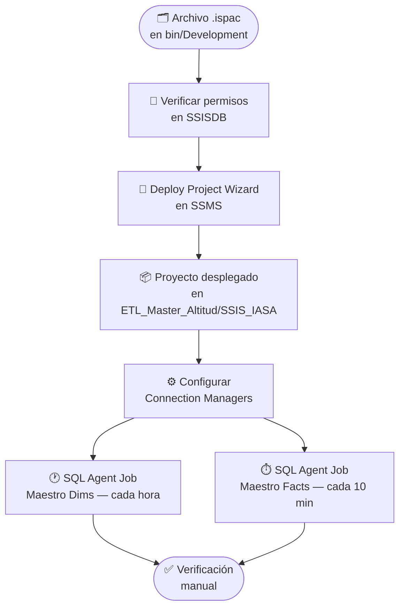

Esta guía describe el proceso completo para desplegar los paquetes SSIS del proyecto **SSIS_IASA** en el catálogo de Integration Services (`SSISDB`) de SQL Server, usando **Windows Authentication**.

---

## 🗺️ Flujo General de Despliegue



---

## 1️⃣ Pasos Previos y Preparación

### 📋 Confirmar el Catálogo SSISDB

Antes de iniciar el despliegue, verifica que el catálogo `SSISDB` esté creado y disponible en tu instancia de SQL Server.

1. Abre **SQL Server Management Studio (SSMS)**.
2. Conéctate a la instancia usando **Windows Authentication**.
3. En el **Object Explorer**, expande el nodo **Integration Services Catalogs**.
4. Confirma que el catálogo **SSISDB** existe y está accesible.

:::caution
Si el nodo **Integration Services Catalogs** no aparece o `SSISDB` no existe, el catálogo debe ser creado primero. Esta tarea la debe realizar un administrador del servidor.
:::

---

### 🔑 Verificar Permisos de Infraestructura

Para poder desplegar proyectos en el catálogo necesitas los siguientes roles dentro de `SSISDB`:

| Rol de Base de Datos | Descripción |
|---|---|
| `ssis_admin` | Permiso completo sobre el catálogo (recomendado para despliegue). |
| `db_owner` en `SSISDB` | Alternativa con control total sobre la base del catálogo. |

:::note
Si recibes errores de acceso al intentar desplegar, contacta a **Roberto** para que asigne los roles necesarios en la instancia de SQL Server.
:::

:::caution[Conexión remota y Windows Authentication]
Si te estás conectando al servidor de forma **remota** (p. ej. vía RDP), la sesión de Windows Authentication en SSMS usará automáticamente el usuario con el que iniciaste sesión en esa sesión remota, **no** el de tu máquina local. Asegúrate de estar conectado con un usuario de dominio que tenga los permisos requeridos sobre `SSISDB`. Si no estás seguro del usuario activo, puedes verificarlo ejecutando `SELECT SYSTEM_USER` en SSMS antes de continuar.
:::

Para verificar tus permisos actuales, ejecuta la siguiente consulta en SSMS conectado a la instancia destino:

```sql
USE SSISDB;
GO
SELECT
    dp.name          AS usuario,
    dp.type_desc     AS tipo,
    r.name           AS rol_asignado
FROM sys.database_role_members rm
JOIN sys.database_principals r  ON rm.role_principal_id  = r.principal_id
JOIN sys.database_principals dp ON rm.member_principal_id = dp.principal_id
WHERE dp.name = SYSTEM_USER;
```

---

### 📂 Localizar el Archivo `.ispac`

El archivo de despliegue es generado automáticamente al compilar el proyecto en Visual Studio.

1. Navega a la carpeta raíz del proyecto **SSIS_IASA** en tu equipo.
2. Accede a la ruta:
   ```
   SSIS_IASA\bin\Development\
   ```
3. Localiza el archivo con extensión **`.ispac`**, por ejemplo:
   ```
   SSIS_IASA.ispac
   ```

:::tip
Si la carpeta `bin/Development` no existe o el archivo `.ispac` no está presente, asegúrate de haber **compilado el proyecto** (`Build > Build Solution`) en Visual Studio / SSDT antes de continuar.
:::

---

## 2️⃣ Proceso de Despliegue en SSMS

### 🧙 Iniciar el Asistente de Despliegue

1. En el **Object Explorer** de SSMS, expande:
   ```
   Integration Services Catalogs > SSISDB > ETL_Master_Altitud > Projects
   ```
2. Haz clic derecho sobre la carpeta **Projects** (o sobre una subcarpeta de destino si ya existe).
3. Selecciona **Deploy Project...**.

> El **Integration Services Deployment Wizard** se abrirá.

---

### 📄 Selección de Fuente (Source)

En la página **Select Source**:

1. Elige la opción **Project deployment file**.
2. Haz clic en **Browse (...)** y navega a:
   ```
   SSIS_IASA\bin\Development\SSIS_IASA.ispac
   ```
3. Selecciona el archivo `.ispac` y confirma.
4. Haz clic en **Next**.

---

### 🎯 Selección de Destino (Destination)

En la página **Select Destination**:

1. En el campo **Server name**, introduce el nombre de la instancia de SQL Server (p. ej. `SERVIDOR\INSTANCIA`).
2. Asegúrate de que la autenticación esté en modo **Windows Authentication**.
3. Haz clic en **Connect**.
4. En el campo **Path**, selecciona o crea la carpeta de destino dentro de `SSISDB`. Por ejemplo:
   ```
   /SSISDB/ETL_Master_Altitud/SSIS_IASA
   ```
5. Haz clic en **Next**.

:::tip
Si la carpeta de destino no existe, puedes crearla directamente desde este asistente haciendo clic en **New Folder**.
:::

---

### ▶️ Revisión y Confirmación

En la página **Review**:

1. Verifica que el origen y destino sean los correctos.
2. Haz clic en **Deploy**.
3. Espera a que el proceso finalice y confirma que **todos los resultados** muestren el estado:

| Paso | Estado Esperado |
|---|---|
| Initialize deployment package | ✅ Passed |
| Load deployment package | ✅ Passed |
| Copy project to target server | ✅ Passed |

:::caution
Si algún paso muestra el estado **Failed**, revisa el mensaje de error. Los problemas más comunes son:
- Permisos insuficientes sobre el catálogo.
- Versión de SQL Server incompatible con el archivo `.ispac`.
- Nombre de instancia incorrecto.
:::

---

## 3️⃣ Configuración Post-Despliegue

### 🔌 Ajuste de Connection Managers

Después del despliegue, los Connection Managers deben apuntar a las bases de datos del servidor de producción y **no** a las cadenas de conexión locales de desarrollo.

1. En el **Object Explorer**, navega hasta el proyecto desplegado:
   ```
   Integration Services Catalogs > SSISDB > ETL_Master_Altitud > Projects > SSIS_IASA
   ```
2. Haz clic derecho sobre el proyecto y selecciona **Configure...**.
3. En la ventana de configuración, navega a la pestaña **Connection Managers**.
4. Verifica y ajusta los valores de los siguientes parámetros para cada conexión:

| Connection Manager | Parámetro clave | Valor esperado (Producción) |
|---|---|---|
| `db_anlitica` | `ServerName` | Servidor de producción |
| `db_anlitica` | `InitialCatalog` | `db_analitica` |
| `db_mirror` | `ServerName` | Servidor de producción |
| `db_mirror` | `InitialCatalog` | `db_mirror` |

5. Haz clic en **OK** para guardar los cambios.

:::note
Todas las conexiones usan **Windows Authentication**. Asegúrate de que la cuenta de servicio del SQL Server Agent tenga acceso a las bases de datos origen y destino.
:::

---

## 4️⃣ Automatización con SQL Server Agent

Se deben crear **dos Jobs** en el Agente de SQL Server: uno para el paquete maestro de dimensiones y otro para el de hechos.

### ⚙️ Crear el Job: Maestro Dimensiones (cada hora)

1. En SSMS, expande **SQL Server Agent > Jobs**.
2. Haz clic derecho en **Jobs** y selecciona **New Job...**.
3. En la pestaña **General**:
   - **Name:** `SSIS_IASA - Maestro Dimensiones`
   - **Description:** `Ejecuta el paquete maestro de dimensiones del ETL de IASA.`
4. En la pestaña **Steps**, haz clic en **New...**:
   - **Step name:** `Ejecutar Maestro Dims`
   - **Type:** `SQL Server Integration Services Package`
   - **Run as:** `SQL Server Agent Service Account`
   - **Package source:** `SSIS Catalog`
   - **Server:** nombre de la instancia
   - **Package:** navega y selecciona `/SSISDB/ETL_Master_Altitud/SSIS_IASA/00_maestro_dims.dtsx`
5. En la pestaña **Schedules**, haz clic en **New...**:
   - **Name:** `Cada hora`
   - **Frequency:** `Recurring`
   - **Occurs:** `Daily`
   - **Recurs every:** `1 hour(s)`
   - **Start time:** `00:00:00`
6. Haz clic en **OK** para guardar el Job.

---

### ⚙️ Crear el Job: Maestro Facts (cada 10 minutos)

1. Repite el proceso anterior para crear un nuevo Job.
2. En la pestaña **General**:
   - **Name:** `SSIS_IASA - Maestro Facts`
   - **Description:** `Ejecuta el paquete maestro de hechos del ETL de IASA.`
3. En la pestaña **Steps**, selecciona el paquete:
   - **Package:** `/SSISDB/ETL_Master_Altitud/SSIS_IASA/00_maestro_facts.dtsx`
4. En la pestaña **Schedules**, configura:
   - **Name:** `Cada 10 minutos`
   - **Recurs every:** `10 minute(s)`
5. Haz clic en **OK** para guardar el Job.

:::tip
Puedes usar la opción **Script Job as > CREATE To** para generar un script T-SQL del Job y guardarlo como respaldo de la configuración.
:::

---

## 5️⃣ Verificación Final

### ✅ Ejecución Manual de Prueba

Antes de confiar en la ejecución automática, realiza una prueba manual de cada Job:

1. En **SQL Server Agent > Jobs**, haz clic derecho sobre `SSIS_IASA - Maestro Dimensiones`.
2. Selecciona **Start Job at Step...** y confirma.
3. Observa los resultados en **Job Activity Monitor** o revisa el historial con **View History**.
4. Repite el proceso para `SSIS_IASA - Maestro Facts`.

### 🔍 Qué verificar tras la ejecución

| Verificación | Cómo comprobarlo |
|---|---|
| Los paquetes hijos son invocados correctamente | En el historial del Job, cada Step debe marcar ✅ `Succeeded` |
| No hay errores de permisos en rutas de datos | El log del paquete no debe contener errores de tipo `Access Denied` |
| Los Connection Managers apuntan al servidor correcto | Revisar los logs de conexión dentro de `SSISDB > Reports > Standard Reports > All Executions` |
| Los datos se cargan en la base analítica | Consultar `db_analitica` y validar que los registros se actualizaron |

:::caution
Si los paquetes hijos fallan con errores de **"Package not found"** o **"Access denied"**, verifica que la cuenta de servicio del SQL Agent tenga el rol `ssis_admin` o `db_datareader` en `SSISDB`.
:::

---

## 📋 Resumen de Referencia Rápida

| Paso | Acción | Herramienta |
|---|---|---|
| 1 | Verificar catálogo `SSISDB` y permisos | SSMS |
| 2 | Compilar proyecto y localizar `.ispac` en `bin/Development` | Visual Studio / SSDT |
| 3 | Ejecutar **Deploy Project Wizard** | SSMS |
| 4 | Configurar Connection Managers a producción | SSMS |
| 5 | Crear Job **Maestro Dims** (cada hora) | SQL Server Agent |
| 6 | Crear Job **Maestro Facts** (cada 10 min) | SQL Server Agent |
| 7 | Ejecutar ambos Jobs manualmente y verificar resultados | SSMS — Job History |
