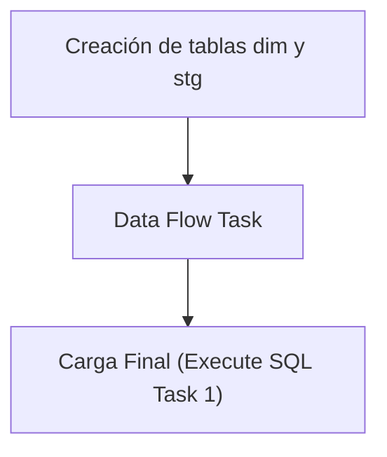

## Procesos ETL

Este documento detalla la lógica de extracción de datos para la tabla **Dim Campana**.

### Flujo del Paquete



### 1. Extracción (Source)
A continuación se muestra la consulta de origen utilizada en el paquete SSIS:

```sql
SELECT
CamId as cam_id,
MatId as material_id,
CamNombre as nombre,
CamFechaInicio as fecha_inicio,
CamFechaFin as fecha_fin
FROM rmtCampañas;

```

### 2. Creación de tablas dim y stg
Si ya existe la tabla **dim_campana** creada, solo se procede a borrar (truncate) la tabla **stg_dim_campana** para prepararla para la nueva carga.

```sql
IF NOT EXISTS (SELECT * FROM sys.objects WHERE name = 'dim_campana')
BEGIN
CREATE TABLE [dim_campana] (
[cam_id] varchar(20),
[material_id] varchar(20),
[nombre] varchar(100),
[fecha_inicio] datetime,
[fecha_fin] datetime
)
END
IF NOT EXISTS (SELECT * FROM sys.objects WHERE name = 'stg_dim_campana')
BEGIN
SELECT TOP 0 * INTO stg_dim_campana FROM dim_campana;
END
ELSE
BEGIN
TRUNCATE TABLE stg_dim_campana;
END
```

### 3. Data Flow Task
El Data Flow Task maneja internamente dos pasos clave:
1. **Lectura de la fuente**: Obtención de datos según la consulta de origen.
2. **Vaciado en la tabla stg**: Inserción de los datos en la tabla temporal **stg_dim_campana**.

### 4. Carga Final (Execute SQL Task 1)
Como último paso, el **Execute SQL Task 1** lee los valores recogidos en la tabla **stg_dim_campana** y los pasa a la tabla **dim_campana** real.

```sql
BEGIN TRANSACTION;
DELETE FROM dim_campana;
INSERT INTO dim_campana SELECT * FROM stg_dim_campana;
COMMIT;
```

