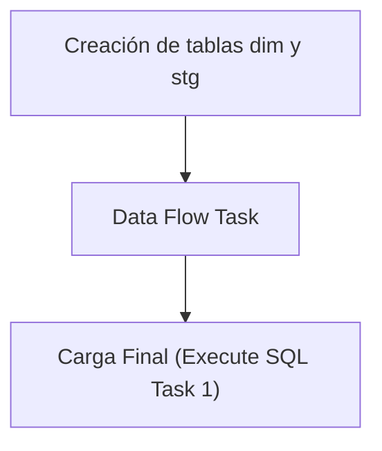

## Procesos ETL

Este documento detalla la lógica de extracción de datos para la tabla **Dim Chofer**.

### Flujo del Paquete



### 1. Extracción (Source)
A continuación se muestra la consulta de origen utilizada en el paquete SSIS:

```sql
SELECT choId, NombreChofer
FROM (
SELECT
choId,
NombreChofer,
ROW_NUMBER() OVER (
PARTITION BY choId
ORDER BY Prioridad ASC, NombreChofer DESC
) AS rnk
FROM (
SELECT
CAST(choId AS VARCHAR(20)) AS choId,
PorNombreChofer AS NombreChofer,
1 AS Prioridad
FROM rmtPorteriaTxn
WHERE choId IS NOT NULL AND CAST(choId AS VARCHAR(20)) <> ''
UNION ALL
SELECT
CAST(ChoId AS VARCHAR(20)) AS ChoId,
RecNombreChofer AS NombreChofer,
2 AS Prioridad
FROM rmtRecepcionTxn
WHERE ChoId IS NOT NULL AND CAST(ChoId AS VARCHAR(20)) <> ''
) AS UnionLimpia
) AS Final
WHERE rnk = 1;

```

### 2. Creación de tablas dim y stg
Si ya existe la tabla **dim_chofer** creada, solo se procede a borrar (truncate) la tabla **stg_dim_chofer** para prepararla para la nueva carga.

```sql
IF NOT EXISTS (SELECT * FROM sys.objects WHERE name = 'dim_chofer')
BEGIN
CREATE TABLE [dim_chofer] (
[chofer_id] varchar(20) PRIMARY KEY,
[nombre] varchar(100)
)
END
IF NOT EXISTS (SELECT * FROM sys.objects WHERE name = 'stg_dim_chofer')
BEGIN
SELECT TOP 0 * INTO stg_dim_chofer FROM dim_chofer;
END
ELSE
BEGIN
TRUNCATE TABLE stg_dim_chofer;
END
```

### 3. Data Flow Task
El Data Flow Task maneja internamente dos pasos clave:
1. **Lectura de la fuente**: Obtención de datos según la consulta de origen.
2. **Vaciado en la tabla stg**: Inserción de los datos en la tabla temporal **stg_dim_chofer**.

### 4. Carga Final (Execute SQL Task 1)
Como último paso, el **Execute SQL Task 1** lee los valores recogidos en la tabla **stg_dim_chofer** y los pasa a la tabla **dim_chofer** real.

```sql
BEGIN TRANSACTION;
DELETE FROM dim_chofer;
INSERT INTO dim_chofer SELECT * FROM stg_dim_chofer;
COMMIT;
```

