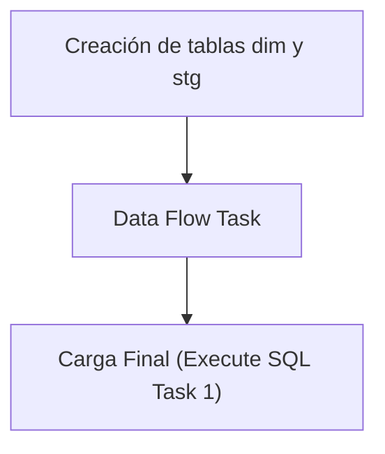

## Procesos ETL

Este documento detalla la lógica de extracción de datos para la tabla **Dim Proveedor**.

### Flujo del Paquete



### 1. Extracción (Source)
A continuación se muestra la consulta de origen utilizada en el paquete SSIS:

```sql
SELECT * FROM [MovMatAlicorp].[dbo].[gntProveedores]

```

### 2. Creación de tablas dim y stg
Si ya existe la tabla **dim_proveedor** creada, solo se procede a borrar (truncate) la tabla **stg_dim_proveedor** para prepararla para la nueva carga.

```sql
IF NOT EXISTS (SELECT * FROM sys.objects WHERE object_id = OBJECT_ID(N'[dbo].[dim_proveedor]') AND type in (N'U'))
BEGIN
CREATE TABLE [dim_proveedor] (
[proveedor_id] varchar(20) NOT NULL,
[nombre] varchar(100),
[direccion] varchar(100),
[prc_id] varchar(20),
[ci] varchar(20),
[zona] varchar(2),
[emp_codigo] varchar(20),
CONSTRAINT PK_dim_proveedor PRIMARY KEY CLUSTERED ([proveedor_id])
)
END
IF NOT EXISTS (SELECT * FROM sys.objects WHERE object_id = OBJECT_ID(N'[dbo].[stg_dim_proveedor]') AND type in (N'U'))
BEGIN
SELECT TOP 0 * INTO stg_dim_proveedor FROM dim_proveedor;
END
ELSE
BEGIN
TRUNCATE TABLE stg_dim_proveedor;
END
```

### 3. Data Flow Task
El Data Flow Task maneja internamente dos pasos clave:
1. **Lectura de la fuente**: Obtención de datos según la consulta de origen.
2. **Vaciado en la tabla stg**: Inserción de los datos en la tabla temporal **stg_dim_proveedor**.

### 4. Carga Final (Execute SQL Task 1)
Como último paso, el **Execute SQL Task 1** lee los valores recogidos en la tabla **stg_dim_proveedor** y los pasa a la tabla **dim_proveedor** real.

```sql
BEGIN TRANSACTION;
DELETE FROM dim_proveedor;
INSERT INTO dim_proveedor SELECT * FROM stg_dim_proveedor;
COMMIT;
```

