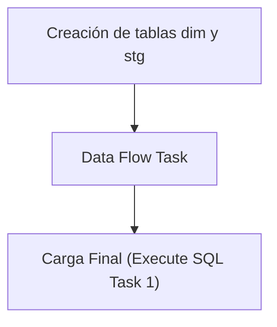

## Procesos ETL

Este documento detalla la lógica de extracción de datos para la tabla **Dim Stock Almacen**.

### Flujo del Paquete



### 1. Extracción (Source)
A continuación se muestra la consulta de origen utilizada en el paquete SSIS:

```sql
SELECT *
FROM [MovMatAlicorp].[dbo].[gntStockAlmacen]

```

### 2. Creación de tablas dim y stg
Si ya existe la tabla **dim_stock_almacen** creada, solo se procede a borrar (truncate) la tabla **stg_dim_stock_almacen** para prepararla para la nueva carga.

```sql
IF NOT EXISTS (SELECT * FROM sys.objects WHERE object_id = OBJECT_ID(N'[dbo].[dim_stock_almacen]') AND type in (N'U'))
BEGIN
CREATE TABLE [dim_stock_almacen] (
[centro_id] varchar(4) NOT NULL,
[almacen_id] varchar(4) NOT NULL,
[material_id] varchar(20) NOT NULL,
[planta_id] varchar(20) NOT NULL,
[capacidad] numeric(18,0),
[stock_libre] numeric(18,0),
[fecha_modificacion] datetime,
[estado] varchar(1),
[periodo_disp_apertura] datetime,
[periodo_disp_cierre] datetime,
CONSTRAINT PK_dim_stock_almacen PRIMARY KEY CLUSTERED (
[centro_id],
[almacen_id],
[material_id],
[planta_id]
)
)
END
IF NOT EXISTS (SELECT * FROM sys.objects WHERE object_id = OBJECT_ID(N'[dbo].[stg_dim_stock_almacen]') AND type in (N'U'))
BEGIN
SELECT TOP 0 * INTO stg_dim_stock_almacen FROM dim_stock_almacen;
END
ELSE
BEGIN
TRUNCATE TABLE stg_dim_stock_almacen;
END
```

### 3. Data Flow Task
El Data Flow Task maneja internamente dos pasos clave:
1. **Lectura de la fuente**: Obtención de datos según la consulta de origen.
2. **Vaciado en la tabla stg**: Inserción de los datos en la tabla temporal **stg_dim_stock_almacen**.

### 4. Carga Final (Execute SQL Task 1)
Como último paso, el **Execute SQL Task 1** lee los valores recogidos en la tabla **stg_dim_stock_almacen** y los pasa a la tabla **dim_stock_almacen** real.

```sql
BEGIN TRANSACTION;
DELETE FROM dim_stock_almacen;
INSERT INTO dim_stock_almacen SELECT * FROM stg_dim_stock_almacen;
COMMIT;
```

