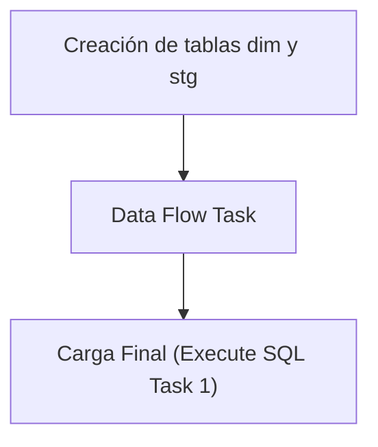

## Procesos ETL

Este documento detalla la lógica de extracción de datos para la tabla **Dim Usuario**.

### Flujo del Paquete



### 1. Extracción (Source)
A continuación se muestra la consulta de origen utilizada en el paquete SSIS:

```sql
SELECT *
FROM [MovMatAlicorp].[dbo].[sgtUsuarioSCL]

```

### 2. Creación de tablas dim y stg
Si ya existe la tabla **dim_usuario** creada, solo se procede a borrar (truncate) la tabla **stg_dim_usuario** para prepararla para la nueva carga.

```sql
IF NOT EXISTS (SELECT * FROM sys.objects WHERE object_id = OBJECT_ID(N'[dbo].[dim_usuario]') AND type in (N'U'))
BEGIN
CREATE TABLE [dim_usuario] (
[usuario_corr_id] int NOT NULL,
[usuario_id] varchar(30),
[planta_id] varchar(20),
[activo] bit,
[fecha_validez] date,
[empresa_default] varchar(100),
[num_dias_atras_bus_sync] int,
[todas_plantas] bit,
[autentica_windows] bit,
[caducidad_dias_contrasena] int,
[cantidad_bloqueo_fallidos] int,
CONSTRAINT PK_dim_usuario PRIMARY KEY CLUSTERED ([usuario_corr_id])
)
END
IF NOT EXISTS (SELECT * FROM sys.objects WHERE object_id = OBJECT_ID(N'[dbo].[stg_dim_usuario]') AND type in (N'U'))
BEGIN
SELECT TOP 0 * INTO stg_dim_usuario FROM dim_usuario;
END
ELSE
BEGIN
TRUNCATE TABLE stg_dim_usuario;
END
```

### 3. Data Flow Task
El Data Flow Task maneja internamente dos pasos clave:
1. **Lectura de la fuente**: Obtención de datos según la consulta de origen.
2. **Vaciado en la tabla stg**: Inserción de los datos en la tabla temporal **stg_dim_usuario**.

### 4. Carga Final (Execute SQL Task 1)
Como último paso, el **Execute SQL Task 1** lee los valores recogidos en la tabla **stg_dim_usuario** y los pasa a la tabla **dim_usuario** real.

```sql
BEGIN TRANSACTION;
DELETE FROM dim_usuario;
INSERT INTO dim_usuario SELECT * FROM stg_dim_usuario;
COMMIT;
```

