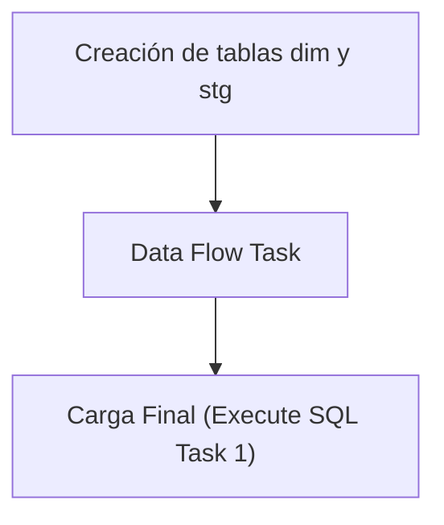

## Procesos ETL

Este documento detalla la lógica de extracción de datos para la tabla **Dim Vehiculo**.

### Flujo del Paquete



### 1. Extracción (Source)
A continuación se muestra la consulta de origen utilizada en el paquete SSIS:

```sql
SELECT [VehId]
,[VehMarca]
,[VehColor]
,[VehTipo]
,[VehEjes]
,[VehCapacidad]
,[VehPropietario]
FROM [MovMatAlicorp].[dbo].[gntVehiculos]

```

### 2. Creación de tablas dim y stg
Si ya existe la tabla **dim_vehiculo** creada, solo se procede a borrar (truncate) la tabla **stg_dim_vehiculo** para prepararla para la nueva carga.

```sql
IF NOT EXISTS (SELECT * FROM sys.objects WHERE object_id = OBJECT_ID(N'[dbo].[dim_vehiculo]') AND type in (N'U'))
BEGIN
CREATE TABLE [dim_vehiculo] (
[vehiculo_id] varchar(20) NOT NULL,
[marca] varchar(20),
[color] varchar(20),
[tipo] varchar(30),
[ejes] int,
[capacidad] int,
[propietario] bit,
CONSTRAINT PK_dim_vehiculo PRIMARY KEY CLUSTERED ([vehiculo_id])
)
END
IF NOT EXISTS (SELECT * FROM sys.objects WHERE object_id = OBJECT_ID(N'[dbo].[stg_dim_vehiculo]') AND type in (N'U'))
BEGIN
SELECT TOP 0 * INTO stg_dim_vehiculo FROM dim_vehiculo;
END
ELSE
BEGIN
TRUNCATE TABLE stg_dim_vehiculo;
END
```

### 3. Data Flow Task
El Data Flow Task maneja internamente dos pasos clave:
1. **Lectura de la fuente**: Obtención de datos según la consulta de origen.
2. **Vaciado en la tabla stg**: Inserción de los datos en la tabla temporal **stg_dim_vehiculo**.

### 4. Carga Final (Execute SQL Task 1)
Como último paso, el **Execute SQL Task 1** lee los valores recogidos en la tabla **stg_dim_vehiculo** y los pasa a la tabla **dim_vehiculo** real.

```sql
BEGIN TRANSACTION;
DELETE FROM dim_vehiculo;
INSERT INTO dim_vehiculo SELECT * FROM stg_dim_vehiculo;
COMMIT;
```

