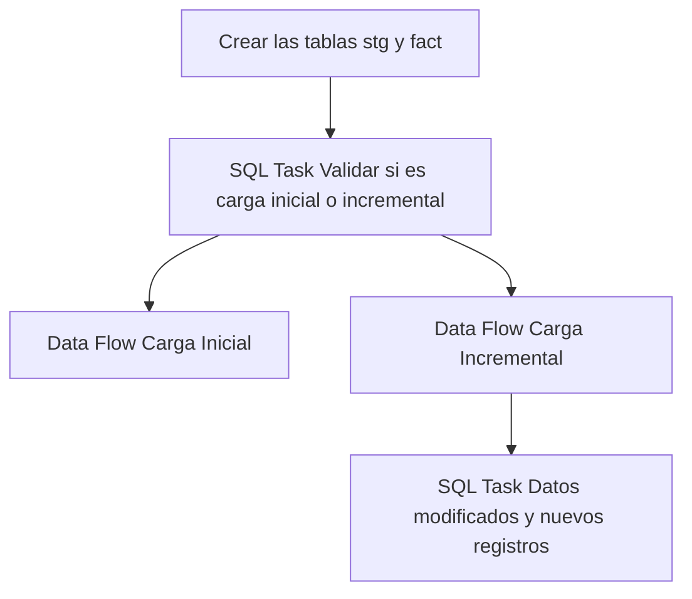

## Procesos ETL

Este documento detalla la lógica de extracción de datos para la tabla **Fact Parqueo**.

### Flujo del Paquete



### 1. Extracción (Source)
A continuación se muestra la consulta de origen utilizada en el paquete SSIS:

```sql
SELECT
parId AS parqueo_id,
parCorrelativoTxn AS correlativo_txn,
ttxId AS ttx_id,
cirId AS circuito_id,
pltId AS planta_id,
parEstado AS estado,
parFechaDoc AS fecha_doc,
GuiId AS gui_id,
parFechaHoraIngreso AS fecha_hora_ingreso,
parFechaHoraSalida AS fecha_hora_salida,
choId AS chofer_id,
traId AS transporte_id,
vehId AS vehiculo_id,
rutCodigo AS rut_codigo,
tipId AS tip_id,
parObservaciones AS observaciones,
plaId AS pla_id,
TtxDestinoSiguiente AS ttx_destino_siguinte,
conId AS con_id,
parInspeccion AS inspeccion,
parEstadoCola AS estado_cola,
parMotivoIngreso AS motivo_ingreso,
parPesoRecibir AS peso_recibir
FROM MovMatAlicorp.dbo.patParqueoTxn
WHERE [parFechaDoc] >= DATEADD(MONTH, -3, GETDATE());

SELECT
parId AS parqueo_id,
parCorrelativoTxn AS correlativo_txn,
ttxId AS ttx_id,
cirId AS circuito_id,
pltId AS planta_id,
parEstado AS estado,
parFechaDoc AS fecha_doc,
GuiId AS gui_id,
parFechaHoraIngreso AS fecha_hora_ingreso,
parFechaHoraSalida AS fecha_hora_salida,
choId AS chofer_id,
traId AS transporte_id,
vehId AS vehiculo_id,
rutCodigo AS rut_codigo,
tipId AS tip_id,
parObservaciones AS observaciones,
plaId AS pla_id,
TtxDestinoSiguiente AS ttx_destino_siguinte,
conId AS con_id,
parInspeccion AS inspeccion,
parEstadoCola AS estado_cola,
parMotivoIngreso AS motivo_ingreso,
parPesoRecibir AS peso_recibir
FROM MovMatAlicorp.dbo.patParqueoTxn
WHERE parFechaDoc > '2025-01-01'

```

### 2. Tareas SQL (Control Flow)
Operaciones de mantenimiento o carga incremental:

#### Tarea 1
```sql
IF NOT EXISTS (SELECT * FROM sys.objects WHERE object_id = OBJECT_ID(N'[dbo].[fact_parqueo]') AND type in (N'U'))
BEGIN
CREATE TABLE [fact_parqueo] (
[parqueo_id] int NOT NULL,
[correlativo_txn] varchar(16),
[ttx_id] varchar(20),
[circuito_id] varchar(20),
[planta_id] varchar(20),
[estado] varchar(1),
[fecha_doc] datetime,
[gui_id] uniqueidentifier,
[fecha_hora_ingreso] datetime,
[fecha_hora_salida] datetime,
[chofer_id] varchar(20),
[transporte_id] varchar(20),
[vehiculo_id] varchar(20),
[rut_codigo] varchar(6),
[tip_id] int,
[observaciones] varchar(500),
[pla_id] int,
[ttx_destino_siguinte] varchar(20),
[con_id] varchar(12),
[inspeccion] varchar(2),
[estado_cola] varchar(2),
[motivo_ingreso] varchar(500),
[peso_recibir] numeric(18,4),
CONSTRAINT PK_fact_parqueo PRIMARY KEY CLUSTERED ([parqueo_id])
)
END
IF NOT EXISTS (SELECT * FROM sys.objects WHERE object_id = OBJECT_ID(N'[dbo].[stg_fact_parqueo]') AND type in (N'U'))
BEGIN
SELECT TOP 0 * INTO stg_fact_parqueo FROM fact_parqueo;
END
ELSE
BEGIN
TRUNCATE TABLE stg_fact_parqueo;
END
```

#### Tarea 2
```sql
User::query_merge
```

#### Tarea 3
```sql
SELECT COUNT(*) FROM [db_Analitica_IASA].[dbo].[fact_parqueo]
```

### Información Adicional (Fact)
Para esta tabla de hechos, el proceso de carga utiliza una tabla de staging que incluye los últimos **3 meses** de datos para asegurar la integridad de la información histórica reciente.
