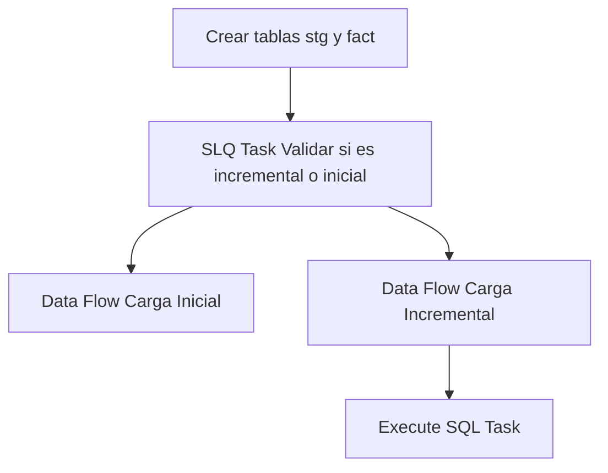

## Procesos ETL

Este documento detalla la lógica de extracción de datos para la tabla **Fact Planta**.

### Flujo del Paquete



### 1. Extracción (Source)
A continuación se muestra la consulta de origen utilizada en el paquete SSIS:

```sql
DECLARE @FechaFiltro DATE = DATEADD(MONTH, -3, GETDATE());
WITH recepcion AS (
SELECT
r.GuiId AS gui_id, r.VehId AS vehiculo_id, r.CirId AS circuito_id,
r.PltId AS planta_id, r.MatId AS material_id, r.RecEstado AS estado,
r.RecFechaHoraPesoSalida AS fecha_hora_peso_salida,
UPPER(REPLACE(REPLACE(REPLACE(REPLACE(r.GuiId,' ',''),'-',''),'{',''),'}','')) AS gui_key
FROM dbo.rmtRecepcionTxn r
WHERE r.RecFechaDoc >= @FechaFiltro
),
porteria AS (
SELECT p.PorFechaHoraIng, p.PorFechaHoraSal,
UPPER(REPLACE(REPLACE(REPLACE(REPLACE(p.GuiId,' ',''),'-',''),'{',''),'}','')) AS gui_key,
ROW_NUMBER() OVER (PARTITION BY p.GuiId ORDER BY p.PorFechaDoc DESC, p.PorId DESC) AS rn
FROM dbo.rmtPorteriaTxn p
WHERE p.PorFechaDoc >= @FechaFiltro
),
pesaje AS (
SELECT s.PesFechaHoraIng, s.PesFechaHoraSal,
UPPER(REPLACE(REPLACE(REPLACE(REPLACE(s.GuiId,' ',''),'-',''),'{',''),'}','')) AS gui_key,
ROW_NUMBER() OVER (PARTITION BY s.GuiId ORDER BY s.PesFechaDoc DESC, s.PesId DESC) AS rn
FROM dbo.rmtPesajesTxn s
WHERE s.PesFechaDoc >= @FechaFiltro
),
descarga AS (
SELECT
DATEADD(SECOND, DATEDIFF(SECOND, '00:00:00', CAST(d.DesHoraIngreso AS TIME)), CAST(d.DesFechaHoraDescarga AS DATETIME)) AS fecha_hora_ingreso_descarga,
DATEADD(SECOND, DATEDIFF(SECOND, '00:00:00', CAST(d.DesHoraSalida AS TIME)), CAST(d.DesFechaHoraDescarga AS DATETIME)) AS fecha_hora_salida_descarga,
UPPER(REPLACE(REPLACE(REPLACE(REPLACE(d.GuiId,' ',''),'-',''),'{',''),'}','')) AS gui_key,
ROW_NUMBER() OVER (PARTITION BY d.GuiId ORDER BY d.DesFechaDoc DESC, d.DesId DESC) AS rn
FROM dbo.rmtControlDescargaTxn d
WHERE d.DesFechaDoc >= @FechaFiltro AND d.DesEstado = 'C'
),
laboratorio AS (
SELECT l.LbtFechaCreacion, l.LbtFechaAprobacion,
UPPER(REPLACE(REPLACE(REPLACE(REPLACE(l.GuiId,' ',''),'-',''),'{',''),'}','')) AS gui_key,
ROW_NUMBER() OVER (PARTITION BY l.GuiId ORDER BY l.LbtFechaDoc DESC, l.LbtId DESC) AS rn
FROM dbo.rmtLaboratorioTxn l
WHERE l.LbtFechaDoc >= @FechaFiltro
)
SELECT
r.planta_id, r.gui_id, r.vehiculo_id, r.circuito_id, r.material_id, r.estado,
r.fecha_hora_peso_salida,
p.PorFechaHoraIng AS fecha_hora_ingreso_porteria,
p.PorFechaHoraSal AS fecha_hora_salida_porteria,
s.PesFechaHoraIng AS fecha_hora_ingreso_pesaje,
s.PesFechaHoraSal AS fecha_hora_salida_pesaje,
d.fecha_hora_ingreso_descarga,
d.fecha_hora_salida_descarga,
l.LbtFechaCreacion AS fecha_hora_creacion_laboratorio,
l.LbtFechaAprobacion AS fecha_hora_aprobacion_laboratorio
FROM recepcion r
LEFT JOIN porteria  p ON p.gui_key = r.gui_key AND p.rn = 1
LEFT JOIN pesaje    s ON s.gui_key = r.gui_key AND s.rn = 1
LEFT JOIN descarga  d ON d.gui_key = r.gui_key AND d.rn = 1
LEFT JOIN laboratorio l ON l.gui_key = r.gui_key AND l.rn = 1;

use MovMatAlicorp;
WITH recepcion AS (
SELECT
r.GuiId AS gui_id,
r.VehId AS vehiculo_id,
r.CirId AS circuito_id,
r.PltId AS planta_id,
r.MatId AS material_id,
r.RecEstado AS estado,
r.RecFechaHoraPesoSalida AS fecha_hora_peso_salida,
UPPER(
REPLACE(
REPLACE(
REPLACE(
REPLACE(r.GuiId,' ',''),'-',''
),'{',''
),'}',''
)
) AS gui_key
FROM dbo.rmtRecepcionTxn r
WHERE r.RecFechaDoc >= '2025-01-01'
),
porteria AS (
SELECT
p.GuiId AS gui_id,
p.PorFechaHoraIng AS fecha_hora_ingreso_porteria,
p.PorFechaHoraSal AS fecha_hora_salida_porteria,
UPPER(
REPLACE(
REPLACE(
REPLACE(
REPLACE(p.GuiId,' ',''),'-',''
),'{',''
),'}',''
)
) AS gui_key,
ROW_NUMBER() OVER (
PARTITION BY
UPPER(
REPLACE(
REPLACE(
REPLACE(
REPLACE(p.GuiId,' ',''),'-',''
),'{',''
),'}',''
)
)
ORDER BY p.PorFechaDoc DESC, p.PorId DESC
) AS rn
FROM dbo.rmtPorteriaTxn p
WHERE p.PorFechaDoc >= '2025-01-01'
),
pesaje AS (
SELECT
s.GuiId AS gui_id,
s.PesFechaHoraIng AS fecha_hora_ingreso_pesaje,
s.PesFechaHoraSal AS fecha_hora_salida_pesaje,
UPPER(
REPLACE(
REPLACE(
REPLACE(
REPLACE(s.GuiId,' ',''),'-',''
),'{',''
),'}',''
)
) AS gui_key,
ROW_NUMBER() OVER (
PARTITION BY
UPPER(
REPLACE(
REPLACE(
REPLACE(
REPLACE(s.GuiId,' ',''),'-',''
),'{',''
),'}',''
)
)
ORDER BY s.PesFechaDoc DESC, s.PesId DESC
) AS rn
FROM dbo.rmtPesajesTxn s
WHERE s.PesFechaDoc >= '2025-01-01'
),
descarga AS (
SELECT
d.GuiId AS gui_id,
CASE
WHEN d.DesFechaHoraDescarga IS NULL OR d.DesHoraIngreso IS NULL THEN NULL
ELSE DATEADD(
SECOND,
DATEDIFF(SECOND, CAST('00:00:00' AS time), CAST(d.DesHoraIngreso AS time)),
CAST(CAST(d.DesFechaHoraDescarga AS date) AS datetime)
)
END AS fecha_hora_ingreso_descarga,
CASE
WHEN d.DesFechaHoraDescarga IS NULL OR d.DesHoraSalida IS NULL THEN NULL
ELSE DATEADD(
SECOND,
DATEDIFF(SECOND, CAST('00:00:00' AS time), CAST(d.DesHoraSalida AS time)),
CAST(CAST(d.DesFechaHoraDescarga AS date) AS datetime)
)
END AS fecha_hora_salida_descarga,
UPPER(
REPLACE(
REPLACE(
REPLACE(
REPLACE(d.GuiId,' ',''),'-',''
),'{',''
),'}',''
)
) AS gui_key,
ROW_NUMBER() OVER (
PARTITION BY
UPPER(
REPLACE(
REPLACE(
REPLACE(
REPLACE(d.GuiId,' ',''),'-',''
),'{',''
),'}',''
)
)
ORDER BY d.DesFechaDoc DESC, d.DesId DESC
) AS rn
FROM dbo.rmtControlDescargaTxn d
WHERE d.DesFechaDoc >= '2025-01-01'
AND d.DesEstado = 'C'
),
laboratorio AS (
SELECT
l.GuiId AS gui_id,
l.LbtFechaCreacion AS fecha_hora_creacion_laboratorio,
l.LbtFechaAprobacion AS fecha_hora_aprobacion_laboratorio,
UPPER(
REPLACE(
REPLACE(
REPLACE(
REPLACE(l.GuiId,' ',''),'-',''
),'{',''
),'}',''
)
) AS gui_key,
ROW_NUMBER() OVER (
PARTITION BY
UPPER(
REPLACE(
REPLACE(
REPLACE(
REPLACE(l.GuiId,' ',''),'-',''
),'{',''
),'}',''
)
)
ORDER BY l.LbtFechaDoc DESC, l.LbtId DESC
) AS rn
FROM dbo.rmtLaboratorioTxn l
WHERE l.LbtFechaDoc >= '2025-01-01'
)
SELECT
r.planta_id,
r.gui_id,
r.vehiculo_id,
r.circuito_id,
r.material_id,
r.estado,
r.fecha_hora_peso_salida,
p.fecha_hora_ingreso_porteria,
p.fecha_hora_salida_porteria,
s.fecha_hora_ingreso_pesaje,
s.fecha_hora_salida_pesaje,
d.fecha_hora_ingreso_descarga,
d.fecha_hora_salida_descarga,
l.fecha_hora_creacion_laboratorio ,
l.fecha_hora_aprobacion_laboratorio
FROM recepcion r
LEFT JOIN porteria    p ON p.gui_key = r.gui_key AND p.rn = 1
LEFT JOIN pesaje      s ON s.gui_key = r.gui_key AND s.rn = 1
LEFT JOIN descarga    d ON d.gui_key = r.gui_key AND d.rn = 1
LEFT JOIN laboratorio l ON l.gui_key = r.gui_key AND l.rn = 1;

```

### 2. Tareas SQL (Control Flow)
Operaciones de mantenimiento o carga incremental:

#### Tarea 1
```sql
IF NOT EXISTS (SELECT * FROM sys.objects WHERE object_id = OBJECT_ID(N'[dbo].[fact_planta]') AND type in (N'U'))
BEGIN
CREATE TABLE [fact_planta] (
[gui_id] uniqueidentifier NOT NULL,
[vehiculo_id] varchar(20),
[circuito_id] varchar(20),
[planta_id] varchar(20),
[material_id] varchar(20),
[estado] varchar(1),
[fecha_hora_peso_salida] datetime,
[fecha_hora_ingreso_porteria] datetime,
[fecha_hora_salida_porteria] datetime,
[fecha_hora_ingreso_pesaje] datetime,
[fecha_hora_salida_pesaje] datetime,
[fecha_hora_ingreso_descarga] datetime,
[fecha_hora_salida_descarga] datetime,
[fecha_hora_creacion_laboratorio] datetime,
[fecha_hora_aprobacion_laboratorio] datetime,
CONSTRAINT PK_fact_planta PRIMARY KEY CLUSTERED ([gui_id])
)
END
IF NOT EXISTS (SELECT * FROM sys.objects WHERE object_id = OBJECT_ID(N'[dbo].[stg_fact_planta]') AND type in (N'U'))
BEGIN
SELECT TOP 0 * INTO stg_fact_planta FROM fact_planta;
END
ELSE
BEGIN
TRUNCATE TABLE stg_fact_planta;
END
```

#### Tarea 2
```sql
User::query_merge
```

#### Tarea 3
```sql
SELECT COUNT(*) FROM [db_Analitica_IASA].[dbo].[fact_planta]
```

### Información Adicional (Fact)
Para esta tabla de hechos, el proceso de carga utiliza una tabla de staging que incluye los últimos **3 meses** de datos para asegurar la integridad de la información histórica reciente.
