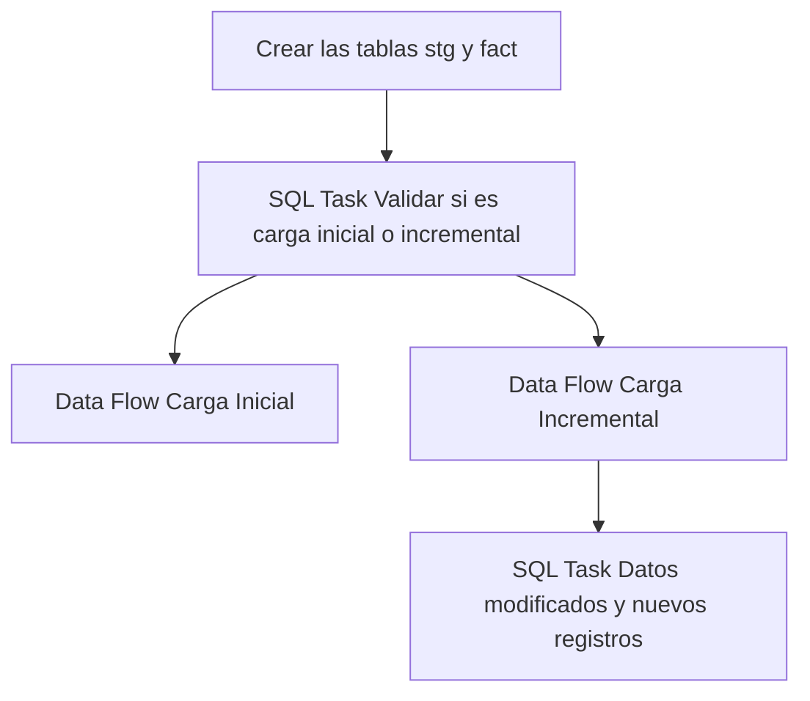

## Procesos ETL

Este documento detalla la lógica de extracción de datos para la tabla **Fact Porteria**.

### Flujo del Paquete



### 1. Extracción (Source)
A continuación se muestra la consulta de origen utilizada en el paquete SSIS:

```sql
SELECT
[PorId] AS porteria_id,
[PorCorrelativoTxn] AS correlativo_txn,
[PltId] AS planta_id,
[VehId] AS vehiculo_id,
[PorUsrIdIng] AS usuario_id_ingreso,
[PorUsrIdSal] AS usuario_id_salida,
[PorusrIdAnulado] AS usuario_id_anulacion,
[TtxId] AS ttx_id,
[PorEstado] AS estado,
[PorFechaDoc] AS fecha_doc,
[PorFechaHoraIng] AS fecha_hora_ingreso,
[PorFechaHoraSal] AS fecha_hora_salida,
[PorFechaHoraAnulacion] AS fecha_hora_anulacion,
[PorMotivoAnulacion] AS motivo_anulacion,
[CirId] AS circuito_id,
[PorObservacion] AS observacion,
[PorChata] AS chata,
[GuiId] AS gui_id,
[TtxDestinoSiguiente] AS ttx_destino_siguiente,
[PorOrdenManual] AS orden_manual,
[PorSincronizacion] AS sincronizacion,
[choId] AS chofer_id,
[BalId] AS bal_id
FROM [MovMatAlicorp].[dbo].[rmtPorteriaTxn]
WHERE [PorFechaDoc] >= DATEADD(MONTH, -3, GETDATE());

SELECT
[PorId] AS porteria_id,
[PorCorrelativoTxn] AS correlativo_txn,
[PltId] AS planta_id,
[VehId] AS vehiculo_id,
[PorUsrIdIng] AS usuario_id_ingreso,
[PorUsrIdSal] AS usuario_id_salida,
[PorusrIdAnulado] AS usuario_id_anulacion,
[TtxId] AS ttx_id,
[PorEstado] AS estado,
[PorFechaDoc] AS fecha_doc,
[PorFechaHoraIng] AS fecha_hora_ingreso,
[PorFechaHoraSal] AS fecha_hora_salida,
[PorFechaHoraAnulacion] AS fecha_hora_anulacion,
[PorMotivoAnulacion] AS motivo_anulacion,
[CirId] AS circuito_id,
[PorObservacion] AS observacion,
[PorChata] AS chata,
[GuiId] AS gui_id,
[TtxDestinoSiguiente] AS ttx_destino_siguiente,
[PorOrdenManual] AS orden_manual,
[PorSincronizacion] AS sincronizacion,
[choId] AS chofer_id,
[BalId] AS bal_id
FROM [MovMatAlicorp].[dbo].[rmtPorteriaTxn]
WHERE PorFechaDoc > '2025-01-01'

```

### 2. Tareas SQL (Control Flow)
Operaciones de mantenimiento o carga incremental:

#### Tarea 1
```sql
IF NOT EXISTS (SELECT * FROM sys.objects WHERE object_id = OBJECT_ID(N'[dbo].[fact_porteria]') AND type in (N'U'))
BEGIN
CREATE TABLE [fact_porteria] (
[porteria_id] int NOT NULL,
[correlativo_txn] varchar(16),
[planta_id] varchar(20),
[vehiculo_id] varchar(20),
[usuario_id_ingreso] varchar(20),
[usuario_id_salida] varchar(20),
[usuario_id_anulacion] varchar(20),
[ttx_id] varchar(20),
[estado] varchar(1),
[fecha_doc] datetime,
[fecha_hora_ingreso] datetime,
[fecha_hora_salida] datetime,
[fecha_hora_anulacion] datetime,
[motivo_anulacion] varchar(100),
[circuito_id] varchar(20),
[observacion] varchar(500),
[chata] bit,
[gui_id] uniqueidentifier,
[ttx_destino_siguiente] varchar(20),
[orden_manual] varchar(20),
[sincronizacion] datetime,
[chofer_id] varchar(20),
[bal_id] varchar(20),
CONSTRAINT PK_fact_porteria PRIMARY KEY CLUSTERED ([porteria_id])
);
END
IF NOT EXISTS (SELECT * FROM sys.objects WHERE object_id = OBJECT_ID(N'[dbo].[stg_fact_porteria]') AND type in (N'U'))
BEGIN
SELECT TOP 0 * INTO stg_fact_porteria FROM fact_porteria;
END
ELSE
BEGIN
TRUNCATE TABLE stg_fact_porteria;
END
```

#### Tarea 2
```sql
User::query_merge
```

#### Tarea 3
```sql
SELECT COUNT(*) FROM [db_Analitica_IASA].[dbo].[fact_porteria]
```

### Información Adicional (Fact)
Para esta tabla de hechos, el proceso de carga utiliza una tabla de staging que incluye los últimos **3 meses** de datos para asegurar la integridad de la información histórica reciente.
