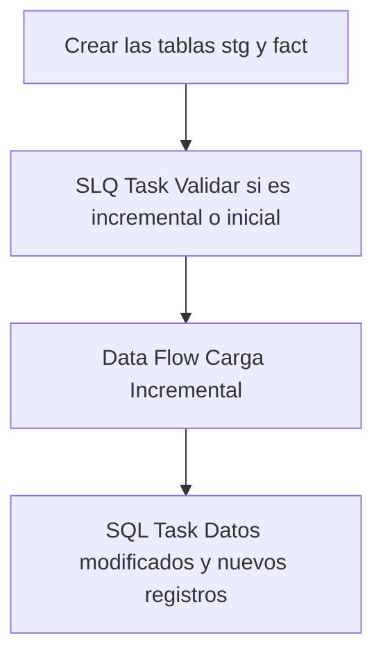

## Procesos ETL

Este documento detalla la lógica de extracción de datos para la tabla **Fact Proyección Transferencia**.

### Flujo del Paquete



### 1. Extracción (Source)
A continuación se muestra la consulta de origen utilizada en el paquete SSIS:

```sql
SELECT 
ptrId as proy_trans_id,
pltIdOrigen as planta_id_origen,
pltIdDestino as planta_id_destino,
camId as cam_id,
matId as material_id,
ptrFecha as fecha,
ptrObjetivoTn as objetivo,
ptrFechaHoraCreacion as fecha_hora_creacion,
ptrFechaHoraModificacion as fecha_hora_modificacion,
usrIdCreador as usuario_id_creador,
usrIdModificacion as usuario_id_modificacion
FROM [MovMatAlicorp].[dbo].[sclProyeccionTransferencia]
WHERE ptrFecha >= DATEADD(MONTH, -3, GETDATE());
```

### 2. Tareas SQL (Control Flow)
Operaciones de mantenimiento o carga incremental:

#### Tarea 1
```sql
IF NOT EXISTS (SELECT * FROM sys.objects WHERE object_id = OBJECT_ID(N'[dbo].[fact_proyeccion_transferencia]') AND type in (N'U'))
BEGIN
    CREATE TABLE [fact_proyeccion_transferencia] (
        [proy_trans_id]               bigint         NOT NULL,
        [planta_id_origen]            varchar(20),
        [planta_id_destino]           varchar(20),
        [cam_id]                      varchar(20),
        [material_id]                 varchar(20),
        [fecha]                       date,
        [objetivo]                    int,
        [fecha_hora_creacion]         datetime,
        [fecha_hora_modificacion]     datetime,
        [usuario_id_creador]          varchar(100),
        [usuario_id_modificacion]     varchar(100),
        CONSTRAINT PK_fact_proyeccion_transferencia PRIMARY KEY CLUSTERED ([proy_trans_id])
    )
END

IF NOT EXISTS (SELECT * FROM sys.objects WHERE object_id = OBJECT_ID(N'[dbo].[stg_fact_proyeccion_transferencia]') AND type in (N'U'))
BEGIN
    SELECT TOP 0 * INTO stg_fact_proyeccion_transferencia FROM fact_proyeccion_transferencia;
END
ELSE
BEGIN
    TRUNCATE TABLE stg_fact_proyeccion_transferencia;
END
```

#### Tarea 2
```sql
SELECT COUNT(*) FROM [db_Analitica_IASA].[dbo].[fact_proyeccion_transferencia]
```

#### Tarea 3
```sql
User::query_merge
```

### Información Adicional (Fact)
Para esta tabla de hechos, el proceso de carga utiliza una tabla de staging que incluye los últimos **3 meses** de datos para asegurar la integridad de la información histórica reciente.
