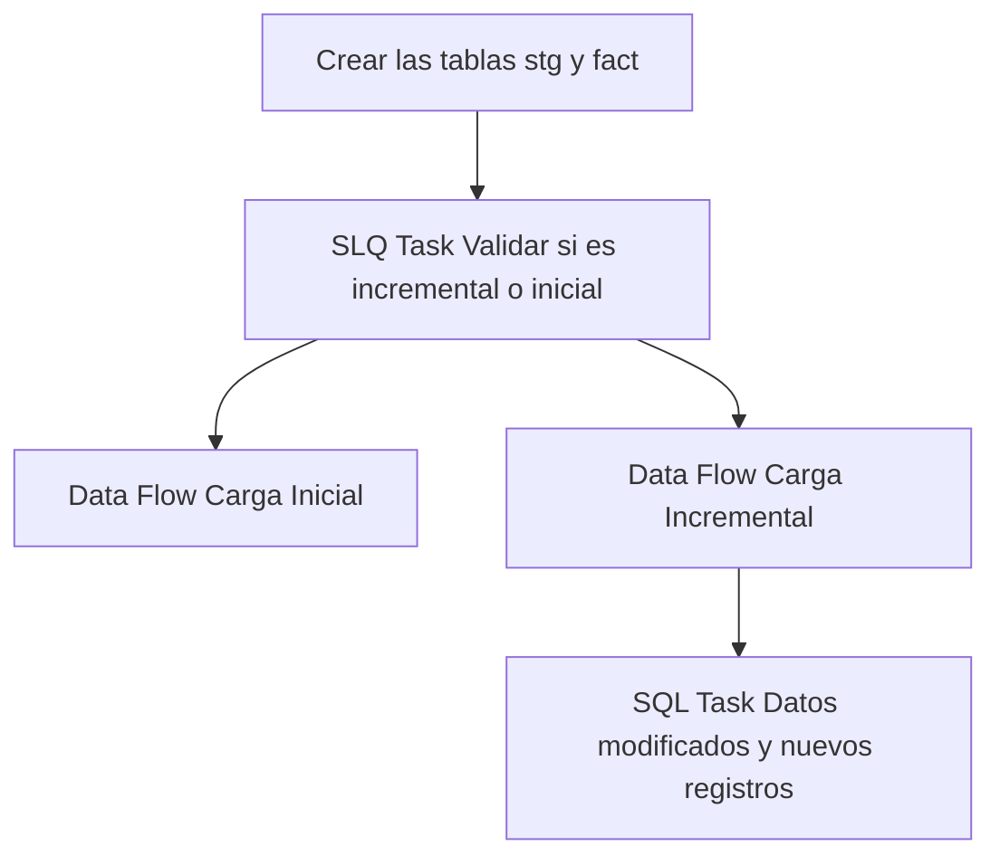

## Procesos ETL

Este documento detalla la lógica de extracción de datos para la tabla **Fact Recepcion**.

### Flujo del Paquete



### 1. Extracción (Source)
A continuación se muestra la consulta de origen utilizada en el paquete SSIS:

```sql
WITH recepcion AS (
SELECT
RecId as recepcion_id,
PltId as planta_id,
RecCorrelativoTxn as correlativo_txn,
RecFechaDoc as fecha_doc,
TtxId as ttx_id,
RecEstado as estado,
PrvId as proveedor_id,
MatId as material_id,
RecPesoIngreso as peso_ingreso,
RecPesoSalida as peso_salida,
RecPesoNeto as peso_neto,
RecGrado as grado,
RecPesoLiquido as peso_liquido,
RecFechaHoraPesoSalida as fecha_hora_peso_salida,
RecObservaciones as observaciones,
RecUsrIdCerrado as usuario_id_cerrado,
RecusrIdAnulado as usuario_id_anulado,
RecPedidoSAP as pedido_sap,
RecEntradaMercanciaSAP as entrada_mercancia_sap,
RecGestionEM as gestion_em,
RecLoteInspeccionSAP as lote_inspeccion_sap,
RecDesicionEmpleoSAP as desicion_empleo_sap,
RecMotivoAnulacion as motivo_anulacion,
RecFechaHoraAnulacion as fecha_hora_anulacion,
CirId as circuito_id,
TtxDestinoSiguiente as ttx_destino_siguiente,
GuiId as gui_id,
RecImpresion as impresion,
RecNumeroRemision as numero_remision,
RecPesoRemision as peso_remision,
PltIdOrigen as planta_id_origen,
RecNumeroNotaManual as numero_nota_manual,
RecNotaManual as nota_manual,
BalId as bal_id,
VehId as vehiculo_id,
RecSAP as sap,
CamId as cam_id
FROM dbo.rmtRecepcionTxn
WHERE RecFechaDoc >= DATEADD(MONTH, -3, GETDATE())
),
lab AS (
SELECT
l.GuiId,
l.LbtCorrelativoTxn,
ROW_NUMBER() OVER (
PARTITION BY l.GuiId
ORDER BY l.LbtFechaDoc DESC, l.LbtId DESC
) AS rn
FROM dbo.rmtLaboratorioTxn l
WHERE l.LbtFechaDoc >= DATEADD(MONTH, -3, GETDATE())
),
lab_det_pivot AS (
SELECT
pvt.LbtCorrelativoTxn,
pvt.[HUMEDAD],
pvt.[IMPUREZA],
pvt.[ACEITE],
pvt.[DAÑADO],
pvt.[QUEMADO],
pvt.[PARTIDO],
pvt.[GRABICO],
pvt.[GRAENFE],
pvt.[GRAINMA1],
pvt.[GRAINMA2]
FROM (
SELECT
d.LbtCorrelativoTxn,
d.CctId,
d.LbtDetValorParcial
FROM dbo.rmtLaboratorioDetalleTxn d
) src
PIVOT (
SUM(LbtDetValorParcial)
FOR CctId IN (
[HUMEDAD],[IMPUREZA],[ACEITE],[DAÑADO],[QUEMADO],
[PARTIDO],[GRABICO],[GRAENFE],[GRAINMA1],[GRAINMA2]
)
) pvt
)
SELECT
r.*,
pv.[HUMEDAD]   AS lab_humedad_parcial,
pv.[IMPUREZA]  AS lab_impureza_parcial,
pv.[ACEITE]    AS lab_aceite_parcial,
pv.[DAÑADO]    AS lab_danado_parcial,
pv.[QUEMADO]   AS lab_quemado_parcial,
pv.[PARTIDO]   AS lab_partido_parcial,
pv.[GRABICO]   AS lab_grabico_parcial,
pv.[GRAENFE]   AS lab_graenfe_parcial,
pv.[GRAINMA1]  AS lab_grainma1_parcial,
pv.[GRAINMA2]  AS lab_grainma2_parcial
FROM recepcion r
LEFT JOIN lab l
ON l.GuiId = r.gui_id
AND l.rn = 1
LEFT JOIN lab_det_pivot pv
ON pv.LbtCorrelativoTxn = l.LbtCorrelativoTxn;

WITH recepcion AS (
SELECT
RecId as recepcion_id,
PltId as planta_id,
RecCorrelativoTxn as correlativo_txn,
RecFechaDoc as fecha_doc,
TtxId as ttx_id,
RecEstado as estado,
PrvId as proveedor_id,
MatId as material_id,
RecPesoIngreso as peso_ingreso,
RecPesoSalida as peso_salida,
RecPesoNeto as peso_neto,
RecGrado as grado,
RecPesoLiquido as peso_liquido,
RecFechaHoraPesoSalida as fecha_hora_peso_salida,
RecObservaciones as observaciones,
RecUsrIdCerrado as usuario_id_cerrado,
RecusrIdAnulado as usuario_id_anulado,
RecPedidoSAP as pedido_sap,
RecEntradaMercanciaSAP as entrada_mercancia_sap,
RecGestionEM as gestion_em,
RecLoteInspeccionSAP as lote_inspeccion_sap,
RecDesicionEmpleoSAP as desicion_empleo_sap,
RecMotivoAnulacion as motivo_anulacion,
RecFechaHoraAnulacion as fecha_hora_anulacion,
CirId as circuito_id,
TtxDestinoSiguiente as ttx_destino_siguiente,
GuiId as gui_id,
RecImpresion as impresion,
RecNumeroRemision as numero_remision,
RecPesoRemision as peso_remision,
PltIdOrigen as planta_id_origen,
RecNumeroNotaManual as numero_nota_manual,
RecNotaManual as nota_manual,
BalId as bal_id,
VehId as vehiculo_id,
RecSAP as sap,
CamId as cam_id
FROM dbo.rmtRecepcionTxn
WHERE RecFechaDoc >= '2025-01-01'
),
lab AS (
SELECT
l.GuiId,
l.LbtCorrelativoTxn,
ROW_NUMBER() OVER (
PARTITION BY l.GuiId
ORDER BY l.LbtFechaDoc DESC, l.LbtId DESC
) AS rn
FROM dbo.rmtLaboratorioTxn l
WHERE l.LbtFechaDoc >= '2025-01-01'
),
lab_det_pivot AS (
SELECT
pvt.LbtCorrelativoTxn,
pvt.[HUMEDAD],
pvt.[IMPUREZA],
pvt.[ACEITE],
pvt.[DAÑADO],
pvt.[QUEMADO],
pvt.[PARTIDO],
pvt.[GRABICO],
pvt.[GRAENFE],
pvt.[GRAINMA1],
pvt.[GRAINMA2]
FROM (
SELECT
d.LbtCorrelativoTxn,
d.CctId,
d.LbtDetValorParcial
FROM dbo.rmtLaboratorioDetalleTxn d
) src
PIVOT (
SUM(LbtDetValorParcial)
FOR CctId IN (
[HUMEDAD],[IMPUREZA],[ACEITE],[DAÑADO],[QUEMADO],
[PARTIDO],[GRABICO],[GRAENFE],[GRAINMA1],[GRAINMA2]
)
) pvt
)
SELECT
r.*,
pv.[HUMEDAD]   AS lab_humedad_parcial,
pv.[IMPUREZA]  AS lab_impureza_parcial,
pv.[ACEITE]    AS lab_aceite_parcial,
pv.[DAÑADO]    AS lab_danado_parcial,
pv.[QUEMADO]   AS lab_quemado_parcial,
pv.[PARTIDO]   AS lab_partido_parcial,
pv.[GRABICO]   AS lab_grabico_parcial,
pv.[GRAENFE]   AS lab_graenfe_parcial,
pv.[GRAINMA1]  AS lab_grainma1_parcial,
pv.[GRAINMA2]  AS lab_grainma2_parcial
FROM recepcion r
LEFT JOIN lab l
ON l.GuiId = r.gui_id
AND l.rn = 1
LEFT JOIN lab_det_pivot pv
ON pv.LbtCorrelativoTxn = l.LbtCorrelativoTxn;

```

### 2. Tareas SQL (Control Flow)
Operaciones de mantenimiento o carga incremental:

#### Tarea 1
```sql
IF NOT EXISTS (SELECT * FROM sys.objects WHERE object_id = OBJECT_ID(N'[dbo].[fact_recepcion]') AND type in (N'U'))
BEGIN
CREATE TABLE [fact_recepcion] (
[recepcion_id] int NOT NULL,
[planta_id] varchar(20),
[correlativo_txn] varchar(16),
[fecha_doc] datetime,
[ttx_id] varchar(20),
[estado] varchar(1),
[proveedor_id] varchar(20),
[material_id] varchar(20),
[peso_salida] bigint,
[peso_neto] bigint,
[grado] float,
[peso_liquido] real,
[fecha_hora_peso_salida] datetime,
[observaciones] varchar(100),
[usuario_id_cerrado] varchar(20),
[usuario_id_anulado] varchar(20),
[pedido_sap] varchar(16),
[entrada_mercancia_sap] varchar(16),
[gestion_em] varchar(4),
[lote_inspeccion_sap] varchar(16),
[motivo_anulacion] varchar(100),
[fecha_hora_anulacion] datetime,
[circuito_id] varchar(20),
[ttx_destino_siguiente] varchar(20),
[gui_id] uniqueidentifier,
[impresion] bit,
[numero_remision] varchar(16),
[peso_remision] int,
[planta_id_origen] varchar(20),
[nota_manual] bit,
[bal_id] varchar(20),
[vehiculo_id] varchar(20),
[sap] bit,
[cam_id] varchar(20),
[peso_ingreso] bigint,
[desicion_empleo_sap] bit,
[numero_nota_manual] varchar(20),
[lab_humedad_parcial] float,
[lab_impureza_parcial] float,
[lab_aceite_parcial] float,
[lab_danado_parcial] float,
[lab_quemado_parcial] float,
[lab_partido_parcial] float,
[lab_grabico_parcial] float,
[lab_graenfe_parcial] float,
[lab_grainma1_parcial] float,
[lab_grainma2_parcial] float,
CONSTRAINT PK_fact_recepcion PRIMARY KEY CLUSTERED ([recepcion_id])
)
END
IF NOT EXISTS (SELECT * FROM sys.objects WHERE object_id = OBJECT_ID(N'[dbo].[stg_fact_recepcion]') AND type in (N'U'))
BEGIN
SELECT TOP 0 * INTO stg_fact_recepcion FROM fact_recepcion;
END
ELSE
BEGIN
TRUNCATE TABLE stg_fact_recepcion;
END
```

#### Tarea 2
```sql
SELECT COUNT(*) FROM [db_Analitica_IASA].[dbo].[fact_recepcion]
```

#### Tarea 3
```sql
User::query_merge
```

### Información Adicional (Fact)
Para esta tabla de hechos, el proceso de carga utiliza una tabla de staging que incluye los últimos **3 meses** de datos para asegurar la integridad de la información histórica reciente.
