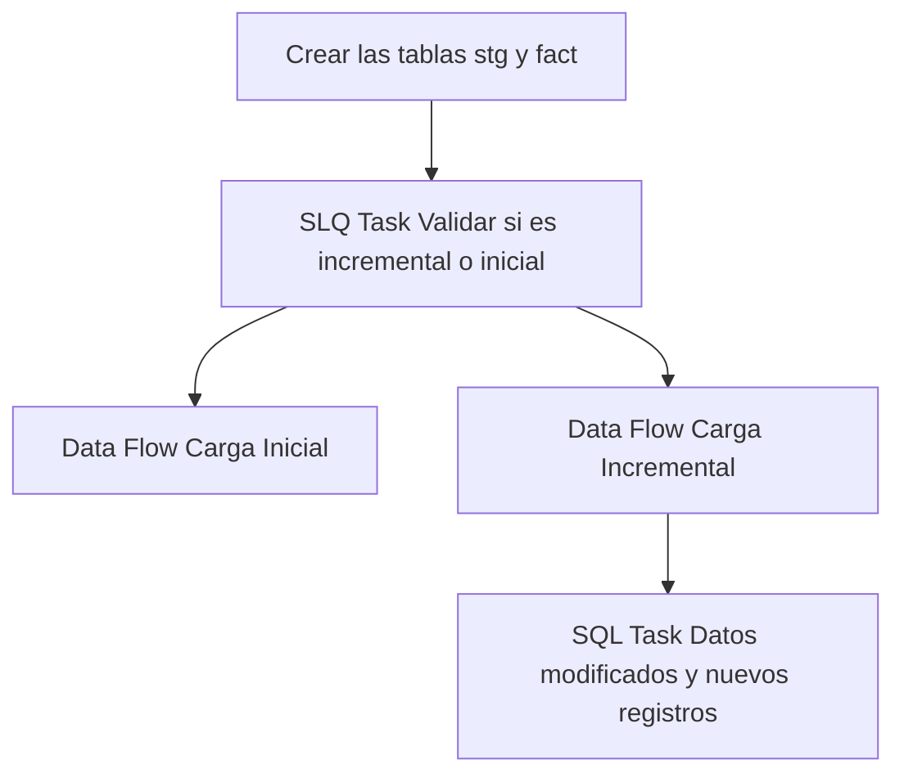

## Procesos ETL

Este documento detalla la lógica de extracción de datos para la tabla **Fact Transferencia**.

### Flujo del Paquete



### 1. Extracción (Source)
A continuación se muestra la consulta de origen utilizada en el paquete SSIS:

```sql
SELECT
TrfId AS transferencia_id,
PltId AS planta_id,
TrfCorrelativoTxn AS correlativo_txn,
TrfFechaDoc AS fecha_doc,
TtxId AS ttx_id,
TrfEstado AS estado,
MatId AS material_id,
TrfPesoIngreso AS peso_ingreso,
TrfPesoSalida AS peso_salida,
TrfPesoNeto AS peso_neto,
TrfGrado AS grado,
TrfFechaHoraPesoSalida AS fecha_hora_peso_salida,
TrfObservaciones AS observaciones,
TrfUsrIdCerrado AS usuario_id_cerrado,
TrfUsrIdAnulado AS usuario_id_anulado,
TrfMotivoAnulacion AS motivo_anulacion,
TrfFechaHoraAnulacion AS fecha_hora_anulacion,
CirId AS circuito_id,
TtxDestinoSiguiente AS ttx_destino_siguiente,
GuiId AS gui_id,
TrfImpresion AS impresion,
TrfNumeroNotaManual AS numero_nota_manual,
TrfNotaManual AS nota_manual,
VehId AS vehiculo_id,
CamId AS cam_id,
TrfSincronizacion AS sincronizacion,
PltIdDestino AS planta_id_destno
FROM [MovMatAlicorp].[dbo].[rmtTransferenciaTxn]
WHERE [TrfFechaDoc] >= DATEADD(MONTH, -3, GETDATE());

SELECT
TrfId AS transferencia_id,
PltId AS planta_id,
TrfCorrelativoTxn AS correlativo_txn,
TrfFechaDoc AS fecha_doc,
TtxId AS ttx_id,
TrfEstado AS estado,
MatId AS material_id,
TrfPesoIngreso AS peso_ingreso,
TrfPesoSalida AS peso_salida,
TrfPesoNeto AS peso_neto,
TrfGrado AS grado,
TrfFechaHoraPesoSalida AS fecha_hora_peso_salida,
TrfObservaciones AS observaciones,
TrfUsrIdCerrado AS usuario_id_cerrado,
TrfUsrIdAnulado AS usuario_id_anulado,
TrfMotivoAnulacion AS motivo_anulacion,
TrfFechaHoraAnulacion AS fecha_hora_anulacion,
CirId AS circuito_id,
TtxDestinoSiguiente AS ttx_destino_siguiente,
GuiId AS gui_id,
TrfImpresion AS impresion,
TrfNumeroNotaManual AS numero_nota_manual,
TrfNotaManual AS nota_manual,
VehId AS vehiculo_id,
CamId AS cam_id,
TrfSincronizacion AS sincronizacion,
PltIdDestino AS planta_id_destno
FROM [MovMatAlicorp].[dbo].[rmtTransferenciaTxn]
WHERE TrfFechaDoc > '2025-01-01';

```

### 2. Tareas SQL (Control Flow)
Operaciones de mantenimiento o carga incremental:

#### Tarea 1
```sql
IF NOT EXISTS (SELECT * FROM sys.objects WHERE object_id = OBJECT_ID(N'[dbo].[fact_transferencia]') AND type in (N'U'))
BEGIN
CREATE TABLE [fact_transferencia] (
[transferencia_id] int NOT NULL,
[planta_id] varchar(20),
[correlativo_txn] varchar(16),
[fecha_doc] datetime,
[ttx_id] varchar(20),
[estado] varchar(1),
[material_id] varchar(20),
[peso_ingreso] bigint,
[peso_salida] bigint,
[peso_neto] bigint,
[grado] float,
[fecha_hora_peso_salida] datetime,
[observaciones] varchar(100),
[usuario_id_cerrado] varchar(20),
[usuario_id_anulado] varchar(20),
[motivo_anulacion] varchar(100),
[fecha_hora_anulacion] datetime,
[circuito_id] varchar(20),
[ttx_destino_siguiente] varchar(20),
[gui_id] uniqueidentifier,
[impresion] bit,
[numero_nota_manual] varchar(20),
[nota_manual] bit,
[vehiculo_id] varchar(20),
[cam_id] varchar(20),
[sincronizacion] datetime,
[planta_id_destno] varchar(20),
CONSTRAINT PK_fact_transferencia PRIMARY KEY CLUSTERED ([transferencia_id])
)
END
IF NOT EXISTS (SELECT * FROM sys.objects WHERE object_id = OBJECT_ID(N'[dbo].[stg_fact_transferencia]') AND type in (N'U'))
BEGIN
SELECT TOP 0 * INTO stg_fact_transferencia FROM fact_transferencia;
END
ELSE
BEGIN
TRUNCATE TABLE stg_fact_transferencia;
END
```

#### Tarea 2
```sql
SELECT COUNT(*) FROM [db_Analitica_IASA].[dbo].[fact_transferencia]
```

#### Tarea 3
```sql
User::query_merge
```

### Información Adicional (Fact)
Para esta tabla de hechos, el proceso de carga utiliza una tabla de staging que incluye los últimos **3 meses** de datos para asegurar la integridad de la información histórica reciente.
